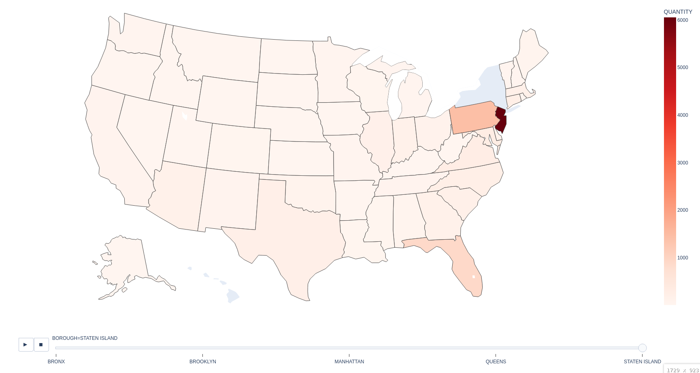

# NewYorkCollisionVisualizations
This choropleth map shows the number of vehicles registered in each U.S. state (excluding New York) that were involved in collisions across New York City boroughs.

## Screenshot

## Dependencies:
``pip install plotly``

## Data sources:
https://data.cityofnewyork.us/Public-Safety/Motor-Vehicle-Collisions-Vehicles/bm4k-52h4/about_data

https://data.cityofnewyork.us/Public-Safety/Motor-Vehicle-Collisions-Crashes/h9gi-nx95/about_data
